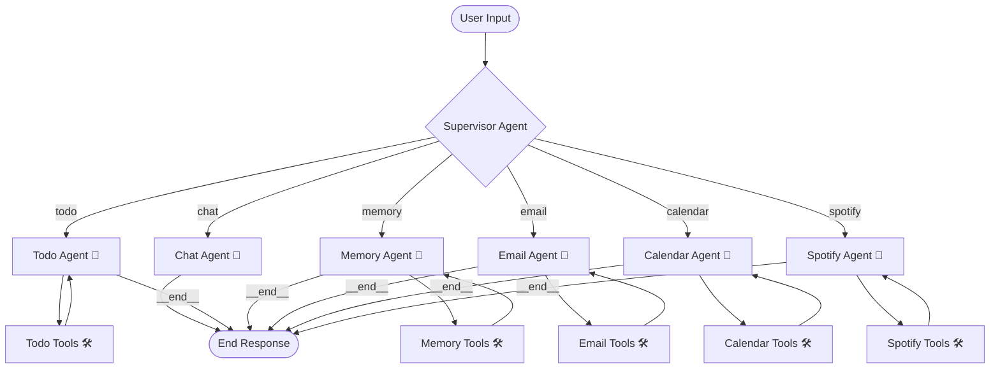
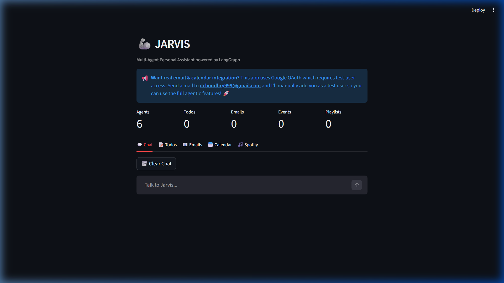
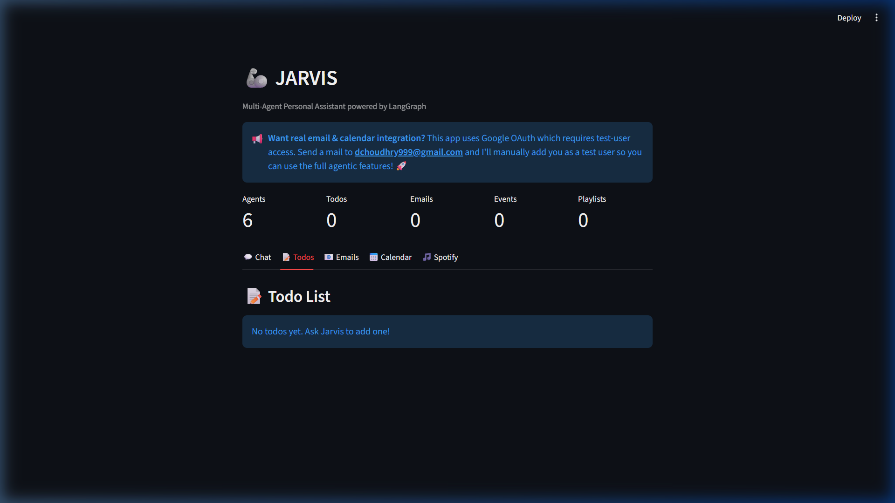
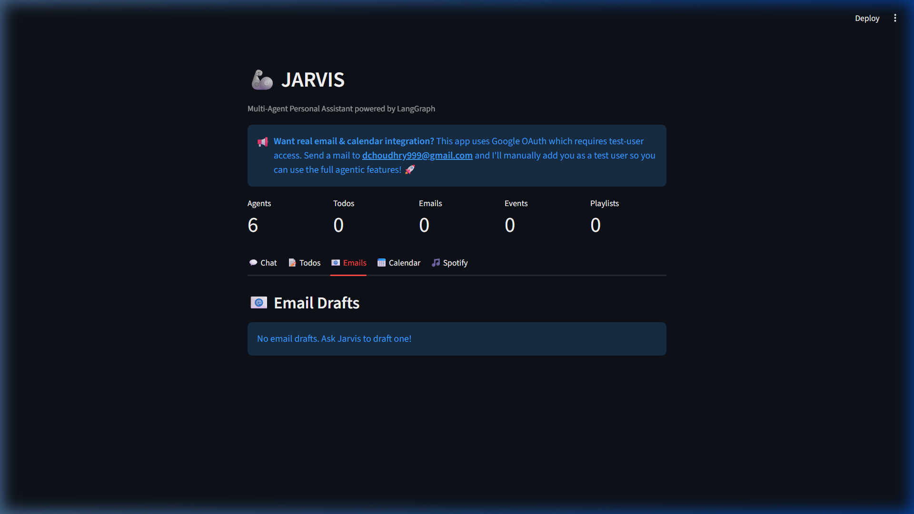
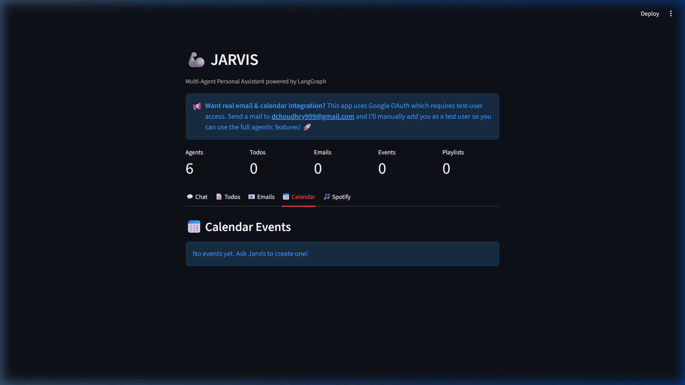
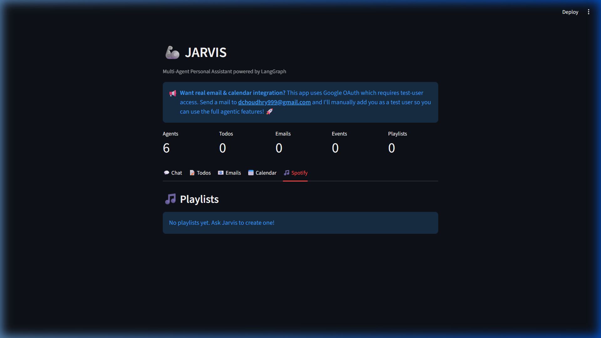
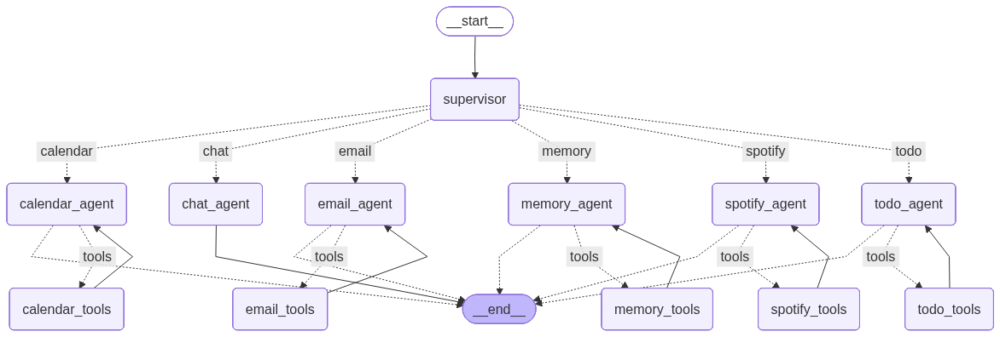

# 🦾 JARVIS AI: Multi-Agent Personal Assistant 🤖

Welcome to **Jarvis AI**, a state-of-the-art multi-agent personal assistant built using **LangGraph**, **LangChain**, and **Streamlit**! Jarvis is powered by the high-performance **llama-3.3-70b-versatile** model via Groq, allowing it to efficiently coordinate and route tasks to specialized agent nodes.

Whether you need to organize your daily schedule, draft emails, manage tasks, search or store personal memories, or manage music playlists, Jarvis acts as your intelligent orchestrator to get it done. 🚀

---

## 🗺️ Multi-Agent Architecture

Jarvis uses a centralized **Supervisor-Agent routing pattern** implemented with **LangGraph**. The user's query is analyzed by a Supervisor node which routes the context to one of the dedicated, specialized agents. Each agent is equipped with custom tools to read and write data.

Here is the computational graph layout for Jarvis:



*(You can see the generated runtime graph visual in `screenshots/graph.png`)*

---

## 🌟 Key Features

Jarvis is split into **6 specialized modules**, each managed by its own autonomous agent:

*   **💬 General Chat (`chat_agent`)**: Conversational agent that handles general queries, greets the user, and provides quick, friendly, and emoji-decorated responses.
*   **📝 Task Management (`todo_agent`)**: Automatically tracks, registers, and reads tasks. Stored locally in a structured JSON database (`data/todos.json`).
*   **🧠 Personal Memory (`memory_agent`)**: Remembers user facts (e.g., names, schedules, preferences) and retrieves them on demand (`data/memories.json`).
*   **📧 Email Workspace (`email_agent`)**: Integrates with Gmail to draft, preview, delete, and send emails. Includes safety confirmation checks before sending.
*   **📅 Calendar Scheduler (`calendar_agent`)**: Schedules, shows, and cancels Google Calendar events. Always double-checks the event specifics with the user before committing.
*   **🎵 Spotify Playlists (`spotify_agent`)**: Creates, visualizes, updates, and deletes music playlists and song allocations (`data/playlists.json`).

---

## 📂 Project Structure

```directory
Jarvis/
├── agents/                  # 🤖 Specialized LangGraph Agent Nodes
│   ├── calendar_agent.py    # Manages calendar flows & tool bindings
│   ├── chat_agent.py        # Friendly conversational node
│   ├── email_agent.py       # Handles email drafting and confirmation
│   ├── memory_agent.py      # Manages user facts & preference memory
│   ├── spotify_agent.py     # Controls playlist creation & modifications
│   ├── supervisor.py        # Keyword-based router & central supervisor
│   └── todo_agent.py        # Manages daily tasks and todos
├── tools/                   # 🛠️ Helper tools used by agent nodes
│   ├── calendar_tools.py    # Calendar reading and writing operations
│   ├── email_tools.py       # Gmail integration and temporary draft files
│   ├── memory_tools.py      # Memory storage and retrieval
│   ├── spotify_tools.py     # Local playlist database modifiers
│   └── todo_tools.py        # Todo JSON database handlers
├── services/                # 🌐 Integrations & OAuth Services
│   ├── calendar_service.py  # Google Calendar API helper
│   ├── gmail_service.py     # Gmail API helper
│   └── google_auth.py       # Shared Google OAuth credentials helper
├── utils/                   # ⚙️ Helper scripts
│   ├── pending_event.py     # Temp storage for event creation approval
│   └── pending_mail.py      # Temp storage for email sending approval
├── data/                    # 📁 Persistent local JSON database storage
├── screenshots/             # 📸 User Interface (UI) screenshots
├── streamlit_app.py         # 🎨 Streamlit Web UI Entry Point
├── graph.py                 # 🕸️ LangGraph structure builder and compiler
├── state.py                 # 📊 State definitions for the LangGraph agents
├── requirements.txt         # 📦 Dependencies list
└── .env                     # 🔑 Environment API keys
```

---

## ⚙️ Setup & Installation

### 1️⃣ Clone the Repository
Open a terminal in your workspace directory:
```bash
git clone <repository_url>
cd Jarvis
```

### 2️⃣ Configure Environment Variables
Create a `.env` file in the root folder of the project and specify your Groq API key:
```env
GROQ_API_KEY=gsk_your_groq_api_key_goes_here
```

### 3️⃣ Configure Google API Credentials (Optional but Recommended)
For Gmail and Google Calendar integrations to work:
1. Go to the [Google Cloud Console](https://console.cloud.google.com/).
2. Create a project and enable the **Gmail API** and **Google Calendar API**.
3. Set up the OAuth consent screen (internal/external) and add your email as a **Test User**.
4. Download the `credentials.json` client configuration file and place it in the root folder of the project.
5. On the first email/calendar run, a local browser tab will open to authenticate the credentials and generate `token.json`.

> 📢 **Want real email & calendar integration?** 
> If you don't want to create your own Google Cloud Console credentials, email **dchoudhry999@gmail.com** and I'll add your Google account to my test-user list so you can authenticate right away! 🚀

### 4️⃣ Set up Virtual Environment and Install Dependencies
```powershell
# Create a virtual environment
python -m venv .venv

# Activate the virtual environment (Windows PowerShell)
.\.venv\Scripts\activate

# Install required dependencies
pip install -r requirements.txt
```

---

## 📸 User Interface (UI) Gallery

Check out the interactive Streamlit user interface below:

### 💬 1. Chat Interface
This is where you converse with Jarvis and issue commands. The supervisor routes your commands to the appropriate agent.


### 📝 2. Task Board
Lists all tasks stored in the local todo database.


### 📧 3. Email Drafts Workspace
Draft and preview your pending emails here before authorizing the agent to send them.


### 📅 4. Calendar Schedule
Synchronizes and displays upcoming meetings, events, and schedules.


### 🎵 5. Spotify Hub
Tracks user-created playlists and custom song listings.


### 🕸️ 6. Compiled Agent Graph
The architecture compiled directly from LangGraph.


---

## 🚀 Running the Application

To launch the interactive dashboard, run:
```bash
streamlit run streamlit_app.py
```
This will start a local web server (usually at `http://localhost:8501`) and automatically open the Jarvis workspace in your browser.

Enjoy using **Jarvis**! 🦾🤖🎶
